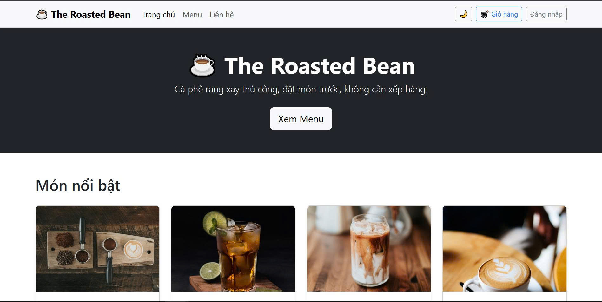
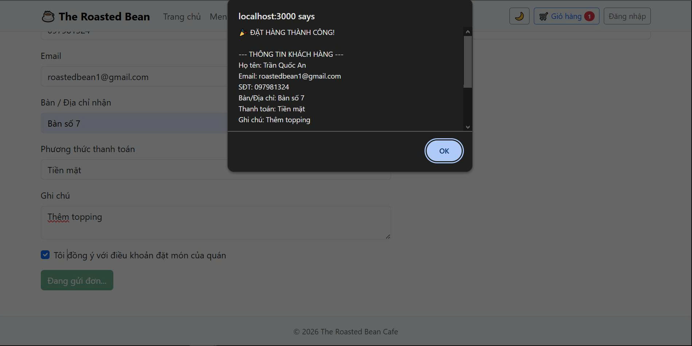
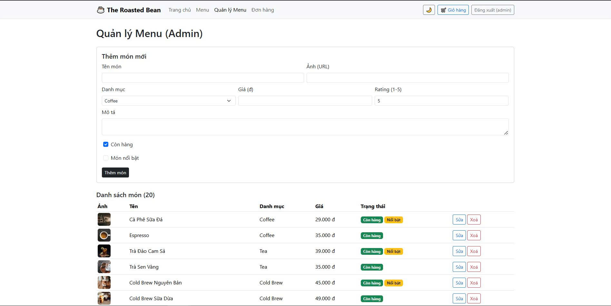

# ☕ The Roasted Bean — Cafe Ordering & Menu Management System

The Roasted Bean là một ứng dụng quản lý và đặt món quán cà phê (Single Page Application) được xây dựng bằng ReactJS. Dự án này được phát triển nhằm giải quyết bài toán tối ưu hóa quy trình gọi món, số hóa menu và cung cấp bảng điều khiển (Dashboard) quản trị cho chủ quán.

---

## 📸 Giao diện ứng dụng (Screenshots)





---

## 🚀 Công nghệ & Kỹ thuật cốt lõi (Tech Stack)

| Nhóm tính năng / Kỹ thuật | Công nghệ áp dụng | Ứng dụng trong dự án |
|---|---|---|
| **Xây dựng UI & Routing** | `ReactJS`, `react-router-dom` | Tạo giao diện dạng Card, hiển thị chi tiết món, điều hướng trang không reload (SPA). |
| **Quản lý State Toàn cục** | `Context API` | Xử lý `AuthContext` (Đăng nhập), `ThemeContext` (Dark/Light mode), `CartContext` (Giỏ hàng). |
| **Xử lý & Validate Form** | `Formik`, `Yup` | Ràng buộc dữ liệu đầu vào, báo lỗi (validation) cho form Liên hệ, Checkout, và Đăng nhập. |
| **Tương tác dữ liệu (API)** | `Fetch API`, `mockapi.io` | Thực hiện các thao tác CRUD (Create, Read, Update, Delete) cho Menu và Đơn hàng. |
| **Bảo mật (Cơ bản)** | `ProtectedRoute` | Phân quyền truy cập, chặn người dùng vãng lai truy cập vào route `/admin/dashboard`. |

---

## 1. Bối cảnh nghiệp vụ (Context)

Quán cà phê **The Roasted Bean** hiện quản lý menu và đơn hàng thủ công (ghi giấy / Excel).
Khách phải hỏi trực tiếp nhân viên mới biết món nào còn, giá bao nhiêu, và không có cách nào đặt trước online. Quản lý quán cũng không có công cụ để thêm/sửa/xoá món ăn nhanh khi đổi menu theo mùa, dẫn đến sai sót giá và tồn kho[cite: 3].

## 2. Vấn đề cần giải quyết (Problems)

- Khách hàng không xem được menu, giá, mô tả món trước khi đến quán[cite: 3].
- Không có giỏ hàng / đặt món trước → khách phải xếp hàng chờ gọi món trực tiếp[cite: 3].
- Nhân viên/quản lý không có công cụ quản lý menu tập trung (thêm, sửa, xoá)[cite: 3].
- Không lưu lại lịch sử đơn đã đặt để đối chiếu khi có khiếu nại[cite: 3].
- Không phân quyền: bất kỳ ai cũng có thể "chỉnh sửa" menu nếu không có hệ thống đăng nhập[cite: 3].

## 3. Đối tượng sử dụng (Primary Actors)

- **Customer (Khách hàng)** — không cần đăng nhập: xem menu, lọc theo danh mục, xem chi tiết món, thêm vào giỏ, đặt hàng (checkout), gửi liên hệ/góp ý[cite: 3].
- **Admin (Quản lý quán)** — cần đăng nhập: quản lý toàn bộ món trong menu (CRUD), xem danh sách đơn hàng khách đã đặt[cite: 3].

## 4. Yêu cầu chức năng (Functional Requirements)

### Dành cho Khách hàng (Customer)
- Xem trang chủ giới thiệu quán và các món nổi bật (Featured)[cite: 3].
- Xem toàn bộ menu dạng lưới card (ảnh, tên, giá, danh mục, rating)[cite: 3].
- Lọc menu theo danh mục: Coffee, Tea, Cold Brew, Pastry[cite: 3].
- Tìm kiếm món theo tên (search box)[cite: 3].
- Xem trang chi tiết 1 món: mô tả, giá, size, chọn số lượng, nút "Thêm vào giỏ"[cite: 3].
- Xem giỏ hàng: tăng/giảm số lượng, xoá món, xem tổng tiền[cite: 3].
- Đặt hàng (Checkout) qua form Formik + Yup: họ tên, SĐT, email, địa chỉ/bàn nhận, phương thức thanh toán, ghi chú, đồng ý điều khoản → gửi đơn lên mockapi.io (`Orders`)[cite: 3].
- Gửi form liên hệ/góp ý (Formik + Yup validate)[cite: 3].
- Chuyển đổi giao diện Light/Dark (ThemeContext)[cite: 3].

### Dành cho Quản trị viên (Admin)
- Đăng nhập bằng form Formik + Yup[cite: 3].
- Trang Dashboard (route được bảo vệ — `ProtectedRoute`):
  - Xem danh sách toàn bộ món (GET API)[cite: 3].
  - Thêm món mới (POST)[cite: 3].
  - Sửa món (PUT): tên, ảnh, danh mục, giá, mô tả, còn hàng hay không (`isAvailable`)[cite: 3].
  - Xoá món (DELETE)[cite: 3].
- Xem danh sách đơn hàng khách đã đặt (GET `Orders`), cập nhật trạng thái đơn[cite: 3].
- Đăng xuất[cite: 3].

## 5. Ghi chú kỹ thuật (Technical Notes)

- Dự án này được thiết kế làm Portfolio trình diễn kỹ năng Front-end. Tài khoản admin được thiết lập sẵn (hardcode) nhằm mục đích demo luồng Authentication.
- Không dùng `localStorage`/`sessionStorage` cho dữ liệu nhạy cảm; chỉ dùng để lưu trạng thái đăng nhập và giỏ hàng tạm thời (nhằm giữ dữ liệu khi reload trang)[cite: 3].

---

## 6. Thiết lập mockAPI.io (Dành cho nhà tuyển dụng/người review code)

Hệ thống sử dụng RESTful API từ mockAPI.io. 
1. Cấu trúc bảng **`MenuItems`**:
```json
{
  "id": "string (auto)",
  "name": "string",
  "category": "string",        
  "price": "number",
  "image": "string (url)",
  "description": "string",
  "rating": "number",          
  "isAvailable": "boolean",
  "isFeatured": "boolean"
}